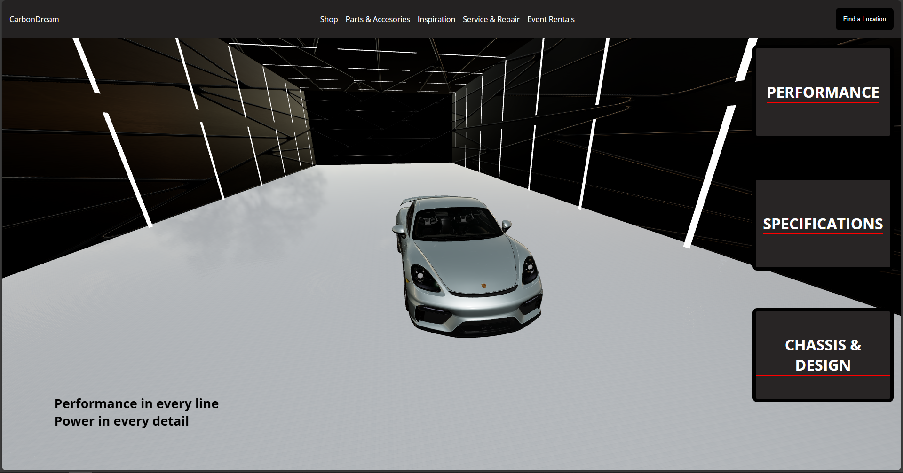

# 3D Car Showcase




## Description

A sleek 3D car visualization project built with React, Vite, and TypeScript.  
It uses Three.js via `@react-three/fiber` and `@react-three/drei` for rendering 3D models.  
The interface is responsive using pure CSS and SCSS.  
New features like multi-car views and interactive camera controls are planned.

## Features

- 3D car model rendering with Three.js  
- Responsive design with pure CSS and SCSS  
- Built with React + Vite + TypeScript + SWC for fast builds  
- Smooth animations with AOS library  
- Styled with Styled Components and React Icons  

## Technologies

- React 19  
- Vite  
- TypeScript  
- Three.js (`@react-three/fiber`, `@react-three/drei`)  
- Styled Components  
- SCSS / CSS  
- AOS (Animate on Scroll)  
- React Icons  

## Installation

1. Clone the repository:  
```bash
git clone https://github.com/your-username/your-repo.git
```

2. Navigate to the project folder:
```bash
cd Z Project 3d 2.0
```

3. Install dependencies:
```bash
npm install
#or
yarn install
```

4. Run the development server:
```bash
npm run dev
# or
yarn dev
```

5. Open http://localhost:5173 in your browser.

Roadmap
- Add multiple car models view
- Improve camera controls and animations
- Add user interaction (select, zoom, rotate)
- Integrate with backend API for car data
- Optimize performance and loading time

Made with by [João Gabriel]

## 📬 Contato

Fique à vontade para entrar em contato:  
**João Gabriel** – Desenvolvedor Full Stack  
[](https://www.linkedin.com/in/jo%C3%A3o-gabriel-s-b22407365/) 

[](mailto:joaogabriell.ssm@gmail.com?subject=Contato%20via%20GitHub&body=Olá%20João,%20vi%20seu%20projeto%20no%20GitHub%20e%20gostaria%20de%20falar%20com%20você.)

